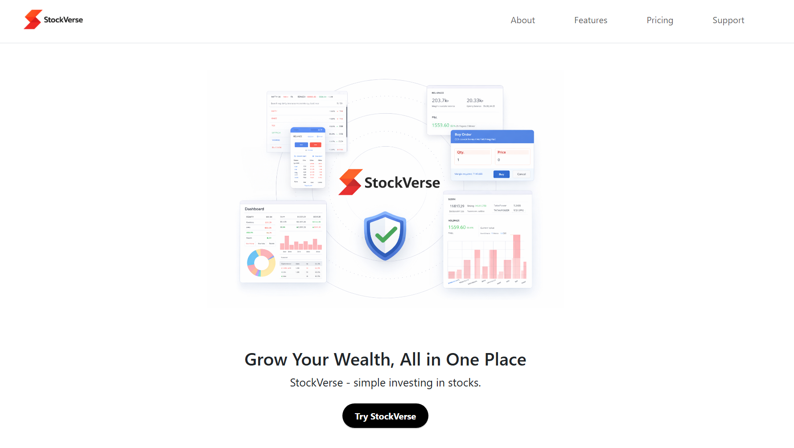
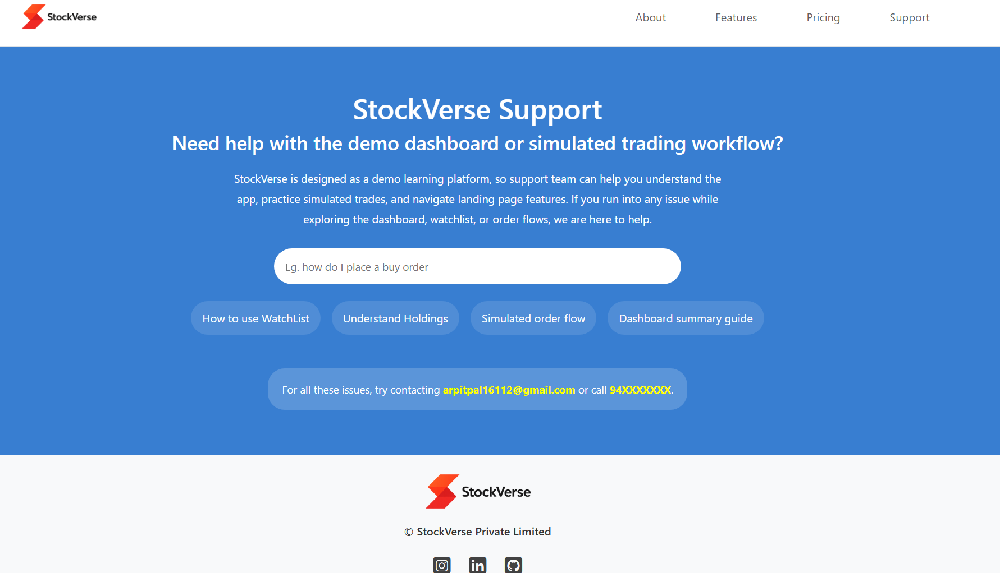
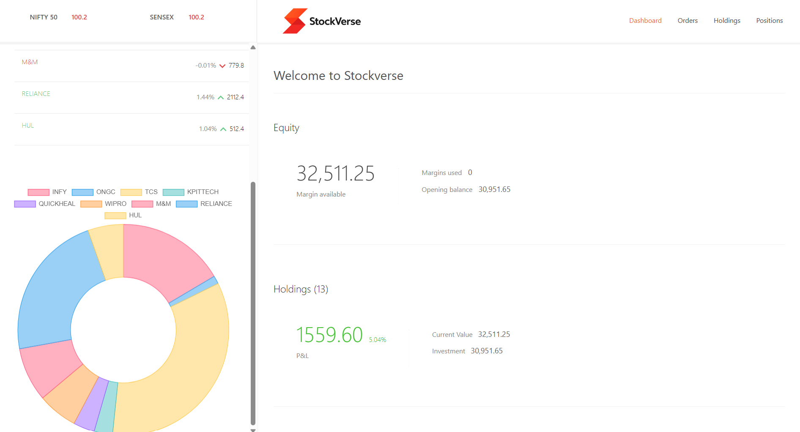
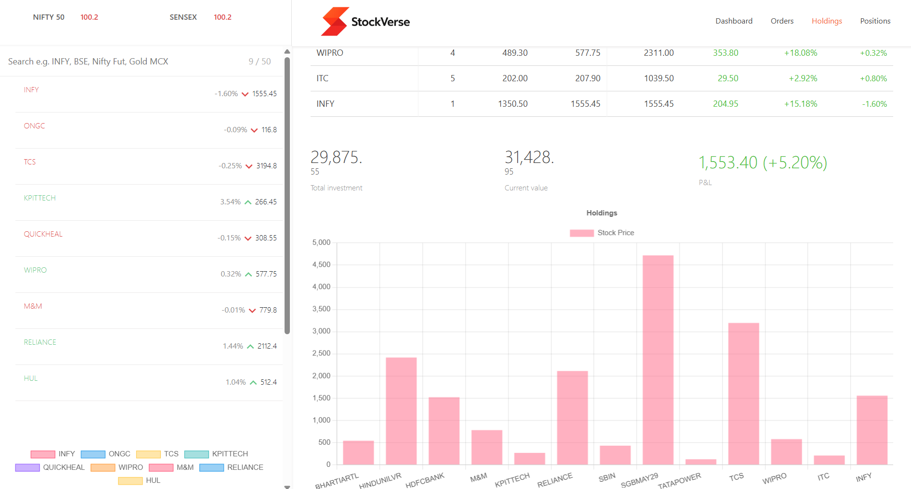

# StockVerse: Your Universe of Trading


StockVerse is a MERN-based full-stack web application built as a portfolio project. It combines a marketing landing page, a React-based stock portfolio dashboard, and an Express/MongoDB backend API for holdings, positions, and orders. The landing page is designed as a modern, single-page marketing experience, while the dashboard offers a route-based interface for portfolio details and order management. The backend stores sample portfolio data in MongoDB and exposes endpoints for the dashboard to fetch holdings, positions, and orders.

The project uses a separate React/Vite landing frontend (`frontend/`), a React/Vite dashboard app (`dashboard/`), and an Express + MongoDB backend (`backend/`).


## 🚀 Live Demo Links

- **Live Landing page Link:** https://stockverse-landing-page.vercel.app
- **Live Dashboard Link:** https://stockverse-your-universe-of-trading.vercel.app
- **Live backend Link:** https://stockverse-backend-r4og.onrender.com

## Overview

StockVerse provides an end-to-end demo of a trading dashboard experience without using live market feeds or user authentication.

The app includes:

- a landing page with about, features, home, pricing & support sections.
- a dashboard that displays holdings, positions, orders, and portfolio summaries
- a backend API that stores and serves holdings, positions, and orders from MongoDB
- a simple order creation flow through the dashboard UI

This project is useful as:

- a full-stack JavaScript portfolio project
- a demonstration of React + Vite frontend apps
- a demo of building a simple Express + MongoDB API
- a dashboard UI connected to a backend data store


## Live Application Screenshots

The following screenshots demonstrate the live landing page and dashboard UI:

#### Landing Page Screenshots



#### Dashboard Screenshots



## Why This Project

The goal was to build a practical stock dashboard experience with separate frontend and backend apps. The focus was on application structure, frontend routing, backend API design, and storing sample portfolio data.

**Authentication is not implemented** because the current scope is to demonstrate the dashboard and backend data flow. Adding authentication would require user registration, protected routes, and session management, which was intentionally left out to keep the project focused on the core portfolio functionality.

**Live stock API integration is not used** because this project uses stored portfolio and position data from MongoDB. Live stock feeds require external API keys, rate limit handling, and additional backend complexity. For this portfolio project, the app instead uses sample data and database-backed API endpoints to demonstrate how the dashboard consumes and displays trading data.

## What The Project Does

The application supports:

- React-based landing page with home, about, products, pricing, and support sections
- React dashboard with route-based sections: summary, holdings, positions, orders
- Dashboard data fetching from a backend API
- Backend routes for `allHoldings`, `allPositions`, `orders`, and `newOrder`
- Order creation from the dashboard UI
- MongoDB storage of holdings, positions, and orders
- CORS-enabled API support for frontend/back-end communication
- database initialization endpoints for sample holdings and positions data

## Key Features

- Separate frontend and dashboard React apps
- Express backend with Mongoose models
- MongoDB database storage
- Axios API calls from dashboard components
- Chart-driven portfolio summary and holdings display
- Order submission UI in the dashboard
- Simple sample data initialization via backend endpoints

## Tech Stack

- JavaScript
- HTML
- CSS
- React
- Vite
- Bootstrap
- Material UI
- Express
- Node.js
- MongoDB
- Mongoose
- Axios
- CORS
- dotenv

## Project Structure

```text
StockVerse/
|-- backend/
|   |-- index.js
|   |-- initData.js
|   |-- package.json
|   |-- schemas/
|   |   |-- holdingsSchema.js
|   |   |-- ordersSchema.js
|   |   |-- positionsSchema.js
|   |-- model/
|       |-- holdingsModel.js
|       |-- ordersModel.js
|       |-- positionsModel.js
|-- dashboard/
|   |-- package.json
|   |-- src/
|   |   |-- App.jsx
|   |   |-- main.jsx
|   |   |-- index.css
|   |   |-- components/
|   |       |-- Dashboard.jsx
|   |       |-- Summary.jsx
|   |       |-- Holdings.jsx
|   |       |-- Positions.jsx
|   |       |-- Orders.jsx
|   |       |-- BuyActionWindow.jsx
|   |       |-- SellActionWindow.jsx
|   |       |-- WatchList.jsx
|   |       |-- TopBar.jsx
|   |       |-- Menu.jsx
|   |       |-- GeneralContext.jsx
|-- frontend/
|   |-- package.json
|   |-- src/
|   |   |-- App.jsx
|   |   |-- main.jsx
|   |   |-- index.css
|   |   |-- landing_page/
|   |       |-- home/
|   |       |-- about/
|   |       |-- pricing/
|   |       |-- support/
|   |-- public/
|       |-- media/images/
|-- .gitignore
|-- README.md
```

## Important Files

- `backend/index.js` — main Express backend serving holdings, positions, orders, and order creation
- `backend/initData.js` — helper script/routes to initialize sample data in MongoDB
- `backend/model/*` — Mongoose models for holdings, positions, and orders
- `backend/schemas/*` — Mongoose schemas used by the backend
- `dashboard/src/App.jsx` — dashboard routing entrypoint
- `dashboard/src/components/Summary.jsx` — portfolio summary component
- `dashboard/src/components/Holdings.jsx` — holdings list and chart data fetch
- `dashboard/src/components/Positions.jsx` — positions list and API fetch
- `dashboard/src/components/Orders.jsx` — order list view
- `dashboard/src/components/BuyActionWindow.jsx` — order creation UI
- `frontend/src/landing_page/home/HomePage.jsx` — landing page main section

## Local Setup

### Backend

```bash
cd backend
npm install
npm start
```

Before running the backend, create `backend/.env` with your MongoDB connection string:

```env
ATLASDB_URL=your_mongodb_connection_string
PORT=8080
```

### Dashboard

```bash
cd dashboard
npm install
npm run dev
```

### Frontend Landing Page

```bash
cd frontend
npm install
npm run dev
```

## Backend API Routes

- `GET /allHoldings` — returns all holdings records
- `GET /allPositions` — returns all positions records
- `GET /orders` — returns all orders
- `POST /newOrder` — saves a new order
- `GET /addHoldings` — inserts sample holdings data into MongoDB
- `GET /addPositions` — inserts sample positions data into MongoDB


## Tools Required

- VS Code
- Chrome (for developer tools)
- Node.js (JavaScript runtime environment)
- Git & GitHub

## Frontend Technologies

- HTML
- CSS
- JavaScript
- React.js
- Bootstrap
- Material UI

## Backend Technologies

- Node.js
- Express.js

## Database Configuration

- MongoDB (NoSQL database)

## Deployment

### Why Vercel and Render

- Vercel is used for the frontend and dashboard because it is optimized for React/Vite static apps, provides fast CDN delivery, automatic HTTPS, and easy deployment from GitHub.
- Render is used for the backend because it supports Node/Express server processes, environment variables, and persistent backend hosting for API endpoints.

### Backend Deployment

This backend is deployed on Render.
- Root directory: `backend`
- Build command: `npm install`
- Start command: `node index.js`
- Environment variables: `ATLASDB_URL`, `PORT`

### Dashboard Deployment

This dashboard is deployed on Vercel.
- Root directory: `dashboard`
- Build command: `npm run build`
- Output directory: `dist`

### Landing Page Deployment

This landing page is deployed on Vercel.
- Root directory: `frontend`
- Build command: `npm run build`
- Output directory: `dist`

## Why No Authentication?

Authentication was not added because this project is focused on demonstrating the frontend and backend data flow for a trading dashboard. Adding authentication would require extra work for login, user management, and protected routes, which was outside the scope of this implementation.

## Why No Live Stock API?

A live stock API was not used because the app relies on sample holdings and positions data stored in MongoDB. Live market data would require external API keys, real-time feed handling, and extra complexity beyond the static portfolio dashboard scope. Using database-backed sample data keeps the project stable and easier to deploy as a portfolio example.

## Notes

- The dashboard uses Axios to fetch data from the backend.
- The backend uses CORS so the dashboard can call API endpoints from a separate origin.
- No authentication or user login flow is implemented.
- The landing page is a static React app and does not require backend connectivity.

## Future Improvements

- add authentication and user-specific dashboard sessions
- replace sample data with real-time stock API feeds
- make backend base URL configurable with environment variables in dashboard
- add better error handling and loading states in the dashboard
- implement actual order validation and persistent order history
